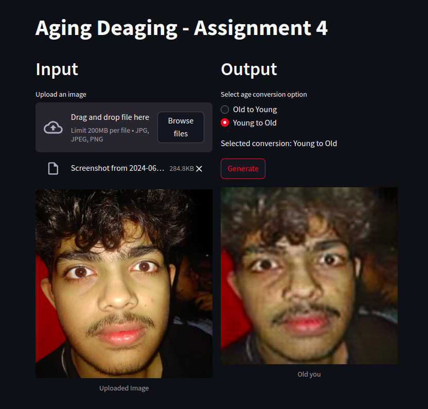

# Illusion Craft 🎨✨

## Summer Project — Programming Club 🌞💻

### Members:
🌟 Aarush Singh Kushwaha 🎓 
🌟 Hardik Tiwari 🎓 
🌟 Ikrima Badr Shamim Ahmed 🎓 
🌟 Meher Narula 🎓

### Important Links:
--> Link to [HuggingFace🤗 Deployment](https://huggingface.co/spaces/AaSiKu/Aging-Deaging)    
-->[Link to weights](https://drive.google.com/drive/folders/10eniPMwQc2_fK2j0QdCUgJrGCBu4Kp4W?usp=sharing)  
--> [This Notebook](/Assignment-4-Group-1.ipynb) contains our code.  
> **NOTE**: You would have to change paths to run the notebook entirely.

## Contents 📑
1. [Problem Statement](#problem-statement)
2. [Cycle-GAN](#cycle-gan)
    - [Architecture](#architecture)
    - [Deployment](#deployment)
3. [Dataset](#dataset)

## Problem Statement 📋

Develop and deploy a CycleGAN-based model capable of aging and de-aging facial images. The deployment includes creating an interactive web application using Streamlit and hosting the model on Hugging Face for scalability. The UTK Face dataset is used for training and validation.

## Cycle-GAN 🔄🎨

CycleGAN enables image-to-image translation, even with unpaired datasets, by treating it as an image reconstruction problem. It uses two generators (G and F) and two discriminators (Dx and Dy) to perform forward and backward cycles, ensuring consistency and realistic outputs.

### Architecture 🏛️

- **Generators**: 
  - **G**: Converts input image \( x \) to the aged/de-aged image.
  - **F**: Converts the aged/de-aged image back to the original image.
- **Discriminators**: Distinguish between real and generated images.
- **Loss Functions**: 
  - **Adversarial Loss**: Ensures generated images are realistic.
  - **Cycle Consistency Loss**: Ensures the transformations are accurate by comparing the input and reconstructed images.

### Deployment 🚀🌐

The model is deployed using:
- **Streamlit**: For creating an interactive web application.
- **Hugging Face**: For hosting the model to ensure ease of access and scalability.  
[Hugging Face link](https://huggingface.co/spaces/AaSiKu/Aging-Deaging)

## Dataset 📊

The [UTK Face dataset](https://www.kaggle.com/datasets/jangedoo/utkface-new), which includes a wide range of ages and demographics, is used for training and validating the model.

---

## Results 🏆
We tried the model on some of our own images, hope you would like the effort 😄🎉

